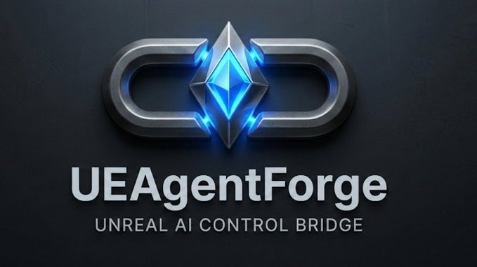

# UEAgentForge

<p align="center">
  
</p>

**The first free, open-source, enterprise-grade AI agent control bridge for Unreal Engine 5.**

UEAgentForge evolves the pattern of basic Remote Control API wrappers into a production-standard framework with unbreakable transaction safety, 4-phase verification, constitution-enforced project governance, a closed-loop OAPA reasoning engine (v0.3.0), and — from v0.4.0 — a professional 5-phase AAA level generation pipeline with named presets, quality scoring, and a closed-loop orchestrator that iterates until your quality threshold is met.

## Why UEAgentForge?

| Feature | Basic RC wrappers (UnrealMCP, etc.) | Commercial tools (Neo AI, etc.) | **UEAgentForge** |
|---|---|---|---|
| Scene manipulation | ✓ | ✓ | ✓ |
| Blueprint node editing | ✗ | ✓ | ✓ |
| Transaction safety + undo | ✗ | Partial | ✓ Full FScopedTransaction |
| Snapshot + rollback test | ✗ | ✗ | ✓ Error-injection verified |
| Constitution enforcement | ✗ | ✗ | ✓ Runtime markdown rules |
| Spatial intelligence | ✗ | ✗ | ✓ Surface-aware spawn, navmesh, density |
| Multi-view capture | ✗ | ✗ | ✓ 4 preset horror angles |
| Environment snapshot | ✗ | ✗ | ✓ Lighting + PP + horror score |
| Closed-loop OAPA reasoning | ✗ | ✗ | ✓ Observe→Analyze→Plan→Act→Verify |
| Genre-aware scene enhancement | ✗ | ✗ | ✓ Horror/dark/thriller presets |
| 5-phase AAA level pipeline | ✗ | Partial | ✓ Blockout→Whitebox→Dressing→Lighting→Living |
| Level preset system | ✗ | ✗ | ✓ Named presets with JSON persistence |
| Python scripting bridge | Partial | ✗ | ✓ |
| Open source | ✓ | ✗ | ✓ MIT |
| Free | ✓ | ✗ | ✓ |

## Architecture

```
AI Agent (Claude, GPT, etc.)
        │
        │ HTTP PUT /remote/object/call
        ▼
┌─────────────────────────────────────────────────────┐
│               UEAgentForge Plugin                   │
│                                                     │
│  AgentForgeLibrary  ←→  VerificationEngine          │
│       │                    │                        │
│  ConstitutionParser    4-Phase Protocol             │
│  (runtime rules)       Phase 1: PreFlight           │
│                        Phase 2: Snapshot+Rollback   │
│                        Phase 3: PostVerify          │
│                        Phase 4: BuildCheck          │
│                                                     │
│  Command Surface (40+ commands)                     │
│  ─ Observation  ─ Actor Control  ─ Blueprints       │
│  ─ Materials    ─ Content Mgmt   ─ Spatial Queries  │
│  ─ Transactions ─ Python Bridge  ─ Perf Profiling   │
└─────────────────────────────────────────────────────┘
        │
        ▼
   Unreal Editor (UE 5.5+)
```

## Installation

1. Copy the `UEAgentForge/` folder into your project's `Plugins/` directory.
2. Re-generate project files (right-click `.uproject` → Generate Visual Studio files).
3. Build the editor: `AquaEchosEditor Win64 Development` (or your project target).
4. Enable **Remote Control API** in `Edit → Plugins → Remote Control`.
5. Keep **Python Script Plugin** enabled if you want `execute_python` support. UEAgentForge also declares it as a plugin dependency for UE 5.7 builds.
6. The plugin auto-loads. Check the Output Log for:
   ```
   [UEAgentForge] Constitution loaded: ... (N rules)
   ```

### Constitution setup (optional but recommended)

Copy `Constitution/ue_dev_constitution_template.md` to your project root as
`ue_dev_constitution.md` and customize the rules for your project.
UEAgentForge will auto-discover and enforce it at startup.

### Python client

```bash
pip install requests
python PythonClient/ueagentforge_client.py
```

## Autonomous Agent Workflow

This repository now includes a Karpathy-style autonomous implementation setup for overnight work:

- `AGENTS.md` - repo-wide operating contract for any coding agent
- `CODEX.md` - Codex-specific entry point
- `program.md` - persistent autonomous delivery loop
- `agent/review_inbox.md` - tracked morning review file for blockers and decisions
- `PythonClient/mcp_server/knowledge_base/building_guide.md` - scene-building and material-selection guidance for MCP/tool agents

The current execution order is:

1. `UEAGENTFORGE_V050_ADDENDUM_A.md`
2. `UEAGENTFORGE_V050_GAMEPLAN.md`

The workflow also explicitly allows Unreal validation through local tooling, including plugin compilation and launching the editor against a host project when a slice needs end-to-end proof.
The root workflow docs include explicit `RunUAT BuildPlugin` and `UnrealEditor.exe` command patterns, plus the safe temporary host project path used for headless smoke tests.
For unattended scratch-host launches, use `agent/tools/launch_runtime_host.ps1`; it disables stale Unreal autosave restore prompts before waiting for Remote Control to come online.

## Current v0.5.0 Validated Slice

The current repo state includes:

- Addendum A scene-building batches through read-only asset discovery, material discovery/application, point/spot/rect/directional lights, actor duplication/label/visibility/mobility/property controls, viewport helpers, compound primitives for walls, floors, rooms, corridors, staircases, pillars, scatter placement, and whole-scene atmosphere controls for fog, sky, and post-process.
- A Python MCP server under `PythonClient/mcp_server/` that exposes scene building, structured-output, streaming-compatible, and vision tools to external agent hosts, plus a tracked `setup.py` bootstrap.
- A Phase 1 and Phase 2 LLM stack under `Source/UEAgentForge/Public/LLM/` and `Source/UEAgentForge/Private/LLM/`, including provider discovery, runtime key configuration, schema-backed structured output, and bundled content schemas under `Content/AgentForge/Schemas/`.
- A Phase 4 vision loop with `vision_analyze` and `vision_quality_score`, plus OAPA scoring that blends semantic and multimodal feedback when a vision-capable provider key is configured.
- Phase 5 Python examples for structured output, NPC dialogue generation, and vision scoring under `PythonClient/examples/`.
- Live RuntimeHost validation artifacts for the latest Addendum A slice are written under `agent/logs/addendum_a_batch3_live_latest.tsv` and the timestamped `addendum_a_batch3_live_*.json` files.

Point your coding agent at `CODEX.md` or `program.md`, then have it work through the addendum and main plan on a dedicated implementation branch.

## Quick Start

### Via Python client

```python
from ueagentforge_client import AgentForgeClient

client = AgentForgeClient()  # verify=True by default

# Check connection
print(client.ping())

# Check forge status (constitution, verification)
print(client.get_forge_status())

# List actors
actors = client.get_all_level_actors()
print(f"{len(actors)} actors in level")

# Spawn with automatic safety pipeline
result = client.spawn_actor("/Script/Engine.StaticMeshActor", x=0, y=0, z=200)
print(result)

# Full verified workflow
with client.transaction("My Safe Workflow"):
    client.spawn_actor("/Script/Engine.StaticMeshActor", x=100, y=100, z=0)
    client.set_actor_transform("MyActor", x=200, y=200, z=100)
```

### Via HTTP (curl / any agent)

```bash
curl -X PUT http://127.0.0.1:30010/remote/object/call \
  -H "Content-Type: application/json" \
  -d '{
    "objectPath": "/Script/UEAgentForge.Default__AgentForgeLibrary",
    "functionName": "ExecuteCommandJson",
    "parameters": {"RequestJson": "{\"cmd\":\"ping\"}"}
  }'
```

### Via Claude Code (AI agent)

```json
{
  "cmd": "run_verification",
  "args": {"phase_mask": 15}
}
```

## Command Reference

### Forge Meta
| Command | Description |
|---|---|
| `ping` | Health check, returns version and constitution status |
| `get_forge_status` | Plugin version, constitution rules loaded, last verification |
| `run_verification` | Run 4-phase verification protocol (`phase_mask` = bitmask 1-15) |
| `enforce_constitution` | Check an action against loaded constitution rules |

### Observation
| Command | Description |
|---|---|
| `get_all_level_actors` | All actors with transforms, class, path |
| `get_actor_components` | Components of a named actor |
| `get_current_level` | Current level package path, map lock status |
| `assert_current_level` | Verify expected level matches current |
| `get_actor_bounds` | AABB origin, extent, min, max |
| `get_available_meshes` | Search Content Browser static meshes by keyword/path |
| `get_available_materials` | Search materials and MICs by keyword/path |
| `get_available_blueprints` | Search Blueprint assets by keyword/path/parent class |
| `get_available_textures` | Search Texture2D assets by keyword/path |
| `get_available_sounds` | Search SoundWave and SoundCue assets by keyword/path |
| `get_asset_details` | Inspect supported asset metadata for meshes, materials, textures, sounds, and blueprints |
| `get_actor_property` | Read an actor or component property via dot-path notation |

### Viewport & Capture
| Command | Description |
|---|---|
| `set_viewport_camera` | Move the first perspective editor viewport camera |
| `redraw_viewports` | Force a rendered frame before screenshot capture |
| `focus_viewport_on_actor` | Frame the active perspective viewport on a target actor |
| `get_viewport_info` | Read location, rotation, FOV, and size from the active perspective viewport |
| `take_screenshot` | Capture viewport to PNG via the staging screenshot path |

### Actor Control
| Command | Description |
|---|---|
| `spawn_actor` | Spawn actor by class path at transform |
| `duplicate_actor` | Duplicate an actor with an optional world-space offset |
| `spawn_point_light` | Spawn and configure a movable point light |
| `spawn_spot_light` | Spawn and configure a movable spot light |
| `spawn_rect_light` | Spawn and configure a movable rect light |
| `spawn_directional_light` | Spawn and configure a movable directional light |
| `set_actor_transform` | Move/rotate actor by object path |
| `set_static_mesh` | Swap the mesh on an actor's static mesh component |
| `set_actor_scale` | Set actor scale in XYZ |
| `set_actor_label` | Rename an actor label in the editor |
| `set_actor_mobility` | Set all scene components on an actor to Static, Stationary, or Movable |
| `set_actor_visibility` | Toggle actor hidden state in the editor |
| `group_actors` | Parent a set of actors under a named group/root actor |
| `set_actor_property` | Write an actor or component property via dot-path notation |
| `create_wall` | Spawn a scaled wall primitive between two points |
| `create_floor` | Spawn a scaled floor primitive centered on an area |
| `create_room` | Spawn a grouped room from floor plus four walls |
| `create_corridor` | Spawn a grouped corridor from floor, walls, and optional ceiling |
| `create_staircase` | Spawn a grouped staircase from repeated step blocks |
| `create_pillar` | Spawn a box or cylinder-based pillar primitive |
| `scatter_props` | Spawn and group repeated mesh props with random placement and optional surface snapping |
| `set_fog` | Create or update an exponential height fog actor |
| `set_post_process` | Create or update the global unbound post-process volume |
| `set_sky_atmosphere` | Apply a named sky preset across sky atmosphere, skylight, and directional light |
| `delete_actor` | Delete actor by label |
| `save_current_level` | Save the current map |

### Spatial Queries
| Command | Description |
|---|---|
| `cast_ray` | Line trace, returns hit location/actor/distance |
| `query_navmesh` | Project point to navigation mesh |

### Blueprint Manipulation
| Command | Description |
|---|---|
| `create_blueprint` | Create new BP asset with parent class |
| `compile_blueprint` | Compile a Blueprint, return errors |
| `set_bp_cdo_property` | Set CDO property value (float/int/bool/string) |
| `edit_blueprint_node` | Edit a graph node's pin values |

### Material & Content
| Command | Description |
|---|---|
| `create_material_instance` | Create MIC from parent material |
| `set_material_params` | Set scalar/vector parameters on MIC |
| `apply_material_to_actor` | Apply a material to a mesh component slot |
| `set_mesh_material_color` | Create/use a MID and push common tint params |
| `set_material_scalar_param` | Set a scalar parameter on an actor MID slot |
| `rename_asset` | Rename content browser asset |
| `move_asset` | Move asset to different content path |
| `delete_asset` | Delete asset (with reference check) |

### LLM & Vision
| Command | Description |
|---|---|
| `llm_set_key` | Store a provider API key in the active editor session without writing it to disk |
| `llm_get_models` | Return the built-in model list for Anthropic, OpenAI, DeepSeek, or OpenAI-compatible providers |
| `llm_chat` | Send a standard chat request through the editor-side LLM subsystem |
| `llm_stream` | Return a stream-compatible chunked response payload for clients that expect incremental output |
| `llm_structured` | Request schema-constrained JSON from the provider |
| `vision_analyze` | Capture the active viewport or a multi-view set and send it through a multimodal model |
| `vision_quality_score` | Return a structured quality score, feedback, issues, and strengths for the current scene |

### Transaction Safety
| Command | Description |
|---|---|
| `begin_transaction` | Open a named undo transaction |
| `end_transaction` | Commit the open transaction |
| `undo_transaction` | Undo last transaction |
| `create_snapshot` | JSON snapshot of all actor states |

### Python Scripting
| Command | Description |
|---|---|
| `execute_python` | Run Python code in the editor process |

### Performance Profiling
| Command | Description |
|---|---|
| `get_perf_stats` | Frame time, draw calls, memory, actor count |

## The 4-Phase Verification Protocol

Every mutating command in UEAgentForge runs through this protocol before changes land:

**Phase 1 — PreFlight (bitmask: `0x01`)**
- Validates the proposed action against all constitution rules
- Captures pre-state actor list and count for comparison
- Fails fast if constitution is violated → no changes made

**Phase 2 — Snapshot + Rollback Test (bitmask: `0x02`)**
- Creates a named JSON snapshot of the current level
- Executes the command inside a temporary `FScopedTransaction`
- Cancels (rolls back) the transaction intentionally
- Verifies the actor count and labels exactly match the pre-state
- **Only if rollback succeeds**: re-executes the command for real
- This guarantees Ctrl+Z will always work correctly

**Phase 3 — PostVerify (bitmask: `0x04`)**
- Queries post-execution state
- Compares actor delta against expected (spawn: +1, delete: -1, transform: 0)
- Logs warnings on unexpected side effects (non-blocking)

**Phase 4 — BuildCheck (bitmask: `0x08`)**
- Iterates all dirty Blueprint assets
- Triggers compilation and checks for `BS_Error` status
- Cancels the real transaction if compilation fails
- Prevents breaking the project with every change

Run all 4 phases: `{"cmd": "run_verification", "args": {"phase_mask": 15}}`

## Constitution System

The constitution parser reads a markdown file at startup and enforces its rules at runtime.

Rules are extracted from bullet lists under headings containing:
`Non-negotiable`, `Rules`, `Constraints`, `Requirements`, or `Enforcement`.

Example:
```markdown
## Non-negotiable constraints

- No plugin source edits unless explicitly approved.
- One change per iteration.
- No magic numbers — use UPROPERTY.
```

Check an action at runtime:
```python
chk = client.enforce_constitution("edit Oceanology plugin source file")
# → {"allowed": false, "violations": ["[RULE_001] No plugin source edits..."]}
```

## Snapshots

Snapshots are stored as JSON in `{ProjectDir}/Saved/AgentForgeSnapshots/`.
Each snapshot captures all actor labels, classes, locations, and rotations.

```python
snap = client.create_snapshot("before_big_change")
# ... make changes ...
# Undo if needed:
client.undo_transaction()
```

### v0.3.0 — Data Access Layer
| Command | Description |
|---|---|
| `get_multi_view_capture` | Viewport screenshot from preset angle (`top`/`front`/`side`/`tension`) |
| `get_level_hierarchy` | Full Outliner tree — actors, parents, components, bounds, tags |
| `get_deep_properties` | All UPROPERTY values on any named actor |
| `get_semantic_env_snapshot` | Lighting analysis, darkness score, PP state, horror rating (0–100) |

### v0.3.0 — Semantic Commands
| Command | Description |
|---|---|
| `place_asset_thematically` | Spawn at dark corners / occluded spots chosen by genre heuristics |
| `refine_level_section` | Iterative analyze → place → verify loop for a target area |
| `apply_genre_rules` | Apply atmosphere preset: `horror` / `dark` / `thriller` / `neutral` |
| `create_in_editor_asset` | Stub — guidance for Geometry Script / Modeling Tools |

### v0.3.0 — Closed-Loop Reasoning
| Command | Description |
|---|---|
| `observe_analyze_plan_act` | Full OAPA loop: Observe→Analyze→Plan→Act→Verify, iterates to score target |
| `enhance_horror_scene` | One-shot horror pipeline: genre rules + thematic props + verify + screenshot |

### v0.3.0 — AI Asset Wiring
| Command | Description |
|---|---|
| `set_bt_blackboard` | Link BlackboardData to BehaviorTree (bypasses Python CPF_Protected) |
| `wire_aicontroller_bt` | Wire BeginPlay→RunBehaviorTree in an AIController Blueprint |

### v0.4.0 — Level Preset System
| Command | Description |
|---|---|
| `list_presets` | List all available preset names (built-in + custom JSON) |
| `load_preset` | Load a named preset — args: `{ preset_name }` |
| `save_preset` | Serialise a preset to `Content/AgentForge/Presets/<name>.json` |
| `suggest_preset` | Analyse the current level and recommend the best preset |
| `get_current_preset` | Return the active preset as JSON |

**Built-in presets:** `Default`, `Horror`, `SciFi`, `Fantasy`, `Military`

### v0.4.0 — Five-Phase AAA Level Pipeline
Each phase is callable independently or as part of the closed-loop `generate_full_quality_level` orchestrator.

| Phase | Command | What it does |
|---|---|---|
| I — RLD/Blockout | `create_blockout_level` | Parses mission text, generates bubble-diagram layout, places box-actor rooms + corridors, adds PlayerStart + NavMesh |
| II — Whitebox | `convert_to_whitebox_modular` | Replaces Blockout_* actors with real modular kit meshes (snapped to grid) |
| III — Set Dressing | `apply_set_dressing` | Scatters story-aware props inside each room, builds micro-story arrangements |
| IV — Lighting | `apply_professional_lighting` | Places key/fill/rim lights, height fog, PP settings, optional god-ray, computes horror score |
| V — Living Systems | `add_living_systems` | Spawns Niagara ambient particle emitters (dust, embers, steam) + AudioVolume soundscapes |
| All Phases | `generate_full_quality_level` | Orchestrates all 5 phases; iterates IV+V until `quality_threshold` (0–1) is met |

**Quality loop:** `generate_full_quality_level` re-runs Phase IV + V up to `max_iterations` times until `EvaluateLevelQuality()` exceeds the threshold. Final quality report included in response.

**Python examples:**
- `generate_blockout_only.py` — rapid Phase I prototype
- `full_5_phase_level_pipeline.py` — complete orchestrated pipeline
- `create_and_save_new_preset.py` — custom preset authoring

### v0.2.0 — Spatial Intelligence
| Command | Description |
|---|---|
| `spawn_actor_at_surface` | Raycast spawn with surface-normal alignment |
| `align_actors_to_surface` | Drop a batch of actors to the nearest surface |
| `get_surface_normal_at` | Surface normal at any world point |
| `analyze_level_composition` | Actor density, bounding box, AI recommendations |
| `get_actors_in_radius` | Sphere search sorted by distance |

### v0.2.0 — FAB Integration
| Command | Description |
|---|---|
| `search_fab_assets` | Search Fab.com (free-only default) |
| `download_fab_asset` | Stub — no public Fab download API (returns workaround) |
| `import_local_asset` | Import FBX/OBJ/PNG/WAV from disk into Content Browser |
| `list_imported_assets` | List assets in a Content Browser folder |

### v0.2.0 — Orchestration
| Command | Description |
|---|---|
| `enhance_current_level` | Natural language → composition + snapshot + verify + screenshot |

## Requirements

- Unreal Engine 5.5 or later (5.7 recommended)
- Remote Control API plugin enabled
- PythonScriptPlugin available (declared as a UEAgentForge dependency in UE 5.7; required for `execute_python`)
- Windows / Linux / Mac (editor targets only)

## Contributing

Contributions welcome. Please:
1. Follow the one-change-per-PR rule
2. Test against UE 5.5+ before submitting
3. Update the command reference table if adding new commands
4. Add a Python example in `PythonClient/examples/` for new features

## License

MIT — see [LICENSE](LICENSE).

---

*UEAgentForge was born from [AquaEchos](https://github.com/RobVanProd/AquaEchos),
a dolphin adventure game built entirely with AI-native Unreal Engine development workflows.*
